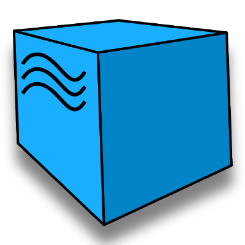

## HI!
___

```java
public class HelloWorld {
    public static void main(String[] args) {
        System.out.println("Automated testing is pretty damn cool!");
    }
}
```

___
[](https://github.com/anuraghazra/github-readme-stats)

<br/>

## Stack

Java | Selenide | Rest-Assured | JUnit5 | IntelliJ IDEA | Gradle | GitHub | Jenkins | Selenoid | Allure
|:------------: | :-------------: | :-------------: | :-------------: | :-------------: | :-------------: | :-------------: | :-------------: | :-------------: | :-------------: |
 |  |  |  |  |  |  | |  | 

___

### My contacts

<a href="https://t.me/Kaspok" target="blank"></a>
<a href="https://vk.com/kaspok" target="blank"></a>
